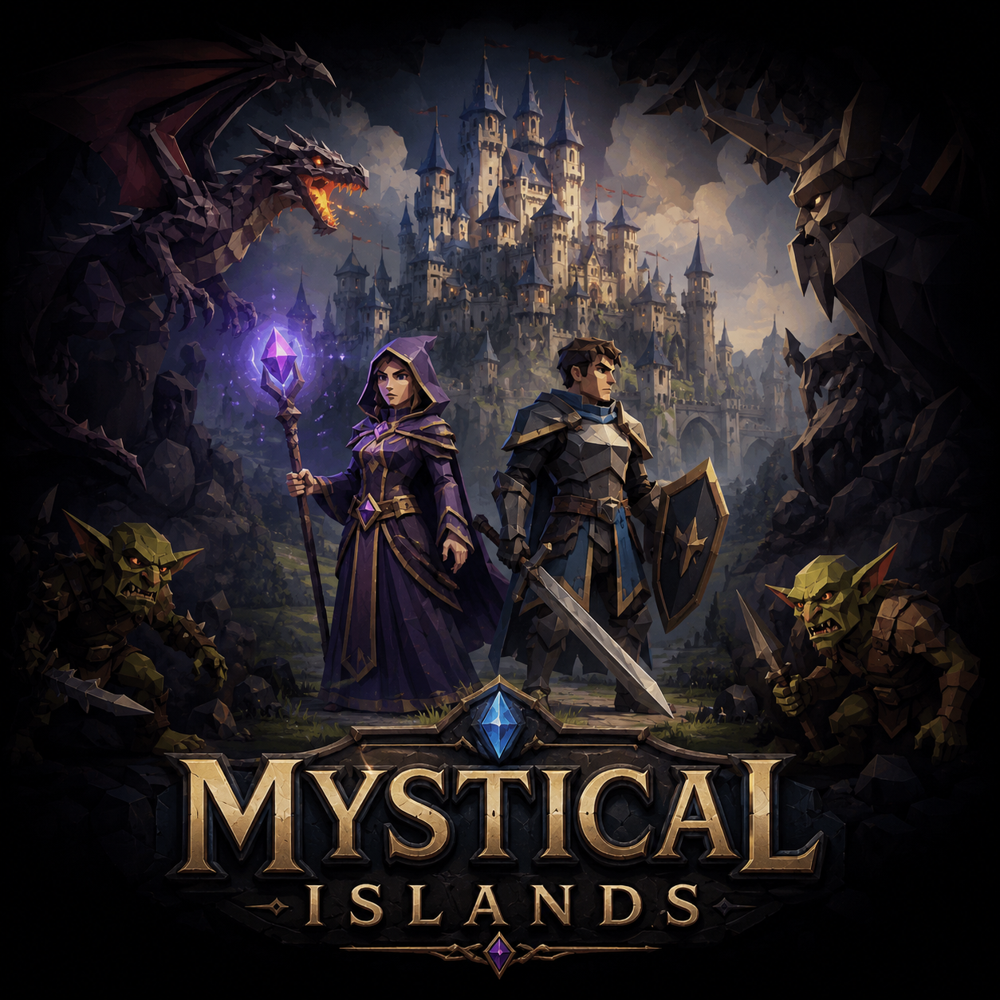

# Mystical Islands

A fractured-seas MMORPG where every voyage is a gamble, every island is a campaign chapter, and every harbor rumor can become your next legend.

## The Call of the Fractured Sea

The old world shattered. Kingdoms became islands. Ancient roads sank beneath stormwater and ruins. What remains is a living archipelago of rival banners, haunted wilderness, dragon-haunted peaks, pirate waters, forgotten crypts, and ports where fortunes change overnight.

In Mystical Islands, you are not following a single corridor to victory. You are charting your own saga through dangerous routes, contested settlements, and mysteries older than the crowns that claim to rule them.

## What Players Will Find

- shattered island frontiers linked by magical harbor ships
- exploration-driven progression with secrets on every coast
- monsters from goblin warbands to dragons and sea horrors
- ruins, crypts, coves, forts, and story-rich encounter zones
- faction politics, guild ambitions, and merchant rivalries
- player-built claims, settlements, and frontier strongholds
- high-risk trade routes, smuggling lanes, and pirate conflict
- a world that rewards curiosity, preparation, and daring

## Why Sail Now

Travel routes are not fully safe or fully known. Some islands are open trade hubs, others are military choke points, and some can only be reached through hidden docks and whispered agreements. The farther you go, the stranger and more dangerous the world becomes.

If you want a sandbox fantasy MMORPG with campaign-book energy, ocean-crossing discovery, and long-term character identity, the Isles are waiting.

# 📚 Documentation

## 🌍 World
- [World History](docs/world-history.md)
- [Islands](docs/islands.md)
- [Bestiary](docs/bestiary.md)

## ⚔ Gameplay
- [Player Characters](docs/player-characters.md)
- [Skills & Abilities](docs/skills-and-abilities.md)
- [Items](docs/items.md)
- [Merchants & Guilds](docs/merchants-and-guilds.md)
- [Building System](docs/building-system.md)
- [Gameplay Guide](docs/gameplay-guide.md)

## 🎨 Artwork
- [Artwork Gallery](Assets/_git/artwork/README.md)

## 🚧 Development
- [Development Roadmap](docs/development-roadmap.md)
- [Database Reference](docs/database-reference.md)
- [Hints & Tips](docs/hints-and-tips.md)

## 🗄 Atavism 10.13 SQL Reference Library
- [SQL Reference Library](docs/sql/reference/README.md)
- [Atavism 10.13 SQL Migration Notes](docs/sql/reference/atavism-10.13-migration-notes.md)

This library documents how Atavism wiki systems map to the actual SQL schema and demo data, so developers and AI tools can later generate safe Mystical Islands SQL inserts.
