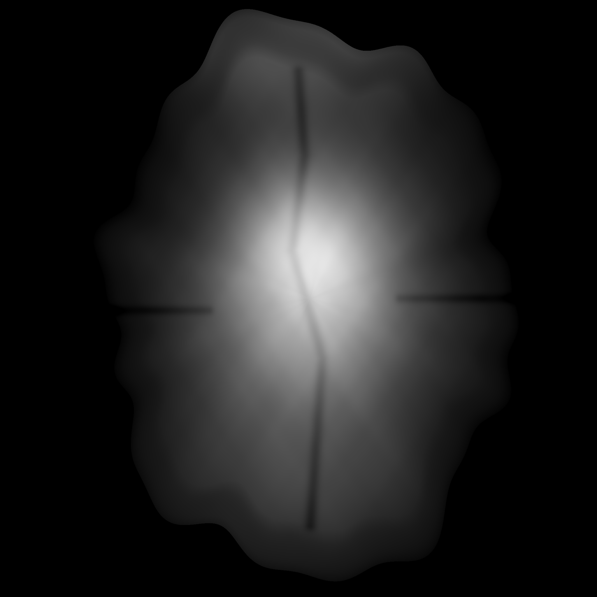
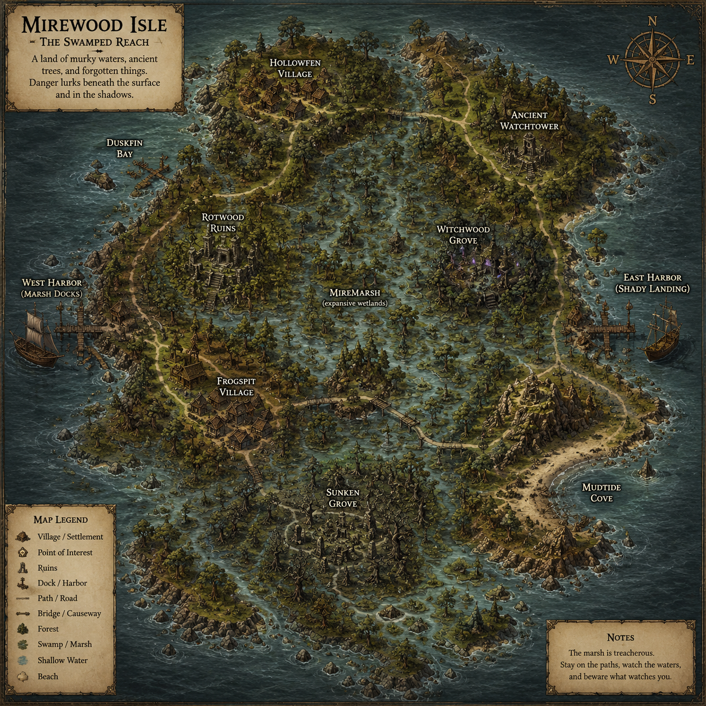
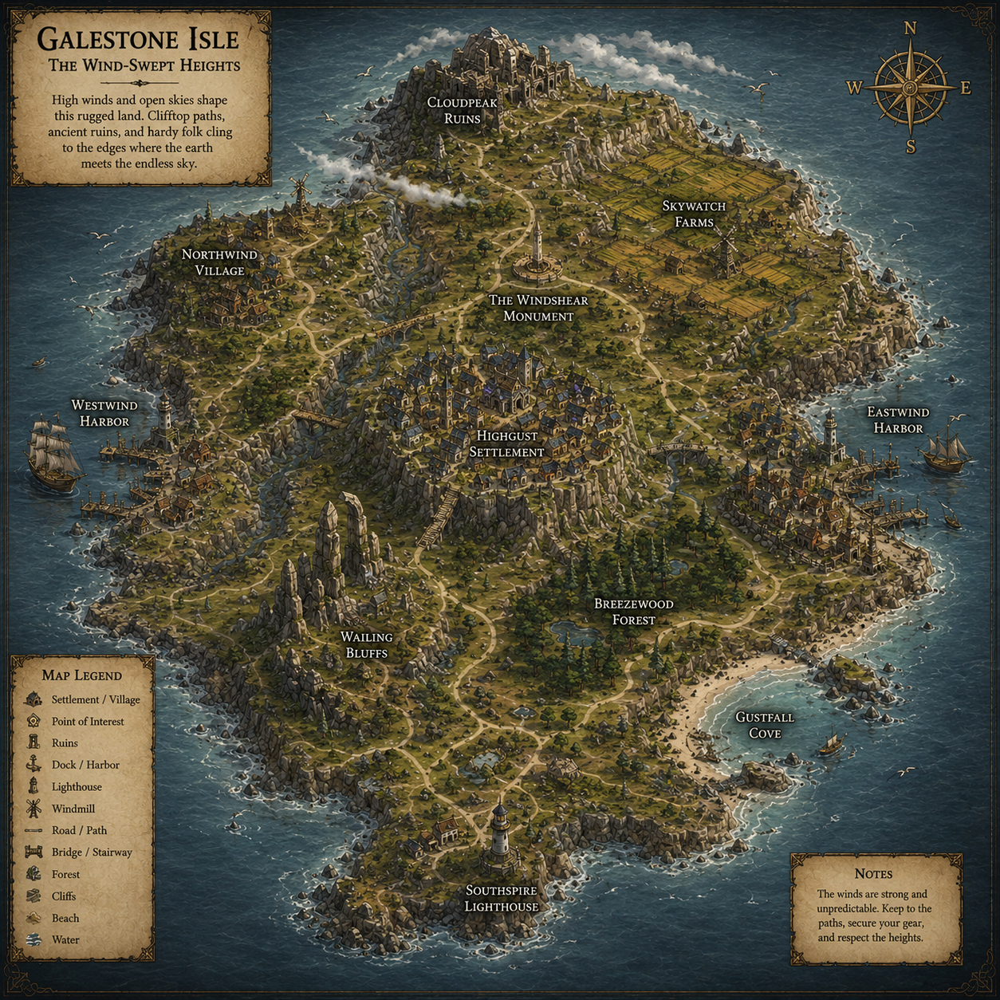

# Islands

Mystical Islands uses a campaign-module world model inspired by classic tabletop RPG settings: every island is a self-contained adventure region with towns, encounter zones, wilderness travel, story locations, and secrets.

## Island Travel System

- Players travel by magical harbor ships that act as portal transitions.
- A boarding interaction triggers a loading screen and transfers the player to the destination island scene.
- Technically, each island is its own Unity scene and Atavism instance.

## Harbor Network Design

Travel routes are intentionally non-fully-connected to create progression, discovery, trade lanes, faction control, smuggling paths, and pirate gameplay.

| Route Type | Example Use |
|---|---|
| Royal harbor lanes | Crown-controlled progression and military movement |
| Trade corridors | Merchant routes between resource islands |
| Smuggler routes | Hidden and black-market travel links |
| Restricted military ports | Story-gated access and faction conflict |
| Hidden docks | Exploration-based shortcuts and secrets |

## Core Island Modules

### Aetherfall Isle
#### Theme
Beginner mainland and social heart of early progression.
#### Level Range
1–10
#### Main City
Aetherfall Harbor-City
#### Villages & Settlements
Greenmeadow, Lantern Dock, Stonelane Parish
#### Major Encounter Zones
Cathedral Crypts, Sewer Warrens, Old Watch Tunnels
#### Adventure Locations
The Sunken Archive, Eastwatch Ruins, Pilgrim Catacombs
#### Wilderness Encounters
Bandit patrols, wolves, corrupted crows, wandering undead
#### Regional Monsters
Skeletons, bandits, goblin scouts, sewer vermin
#### Factions
King's Guard, Dock Syndicate, Novice Adventurers Guild
#### Resources
Timber, iron, herbs, fish, cloth
#### Story Hooks
Missing patrols, contraband ring, crypt seal breach
#### Harbor Connections
Crownspire (royal lane), Stoneclaw (trade), Blackreef (restricted permit route)

#### Island Map

##### Downloads
- [View Full Player Map](../artwork/maps/aetherfall-player-map.png)
- [Download Terrain Heightmap](../artwork/heightmaps/aetherfall-heightmap.png)

### Crownspire Isle
#### Theme
Capital fortress island and political center.
#### Level Range
8–20
#### Main City
Crownspire Citadel
#### Villages & Settlements
King's Quarter, Wardens' Bastion, Old Foundry Ward
#### Major Encounter Zones
Castle Undervault, Ward Lock Tunnels, Palace Catacombs
#### Adventure Locations
Elyra's Sealed Hall, War Table Archives, Bastion Vault
#### Wilderness Encounters
Guard patrol conflicts, royal hunts, covert cult activity
#### Regional Monsters
Elite guards gone rogue, cultists, animated constructs
#### Factions
King's Guard HQ, Royal Court, Crownward League
#### Resources
Steel, records, military contracts, royal seals
#### Story Hooks
Succession intrigue, missing ward key, civil sabotage
#### Harbor Connections
Aetherfall, Frostfang military lane, Sylvanreach diplomatic lane

#### Island Map

##### Downloads
- [View Full Player Map](../artwork/maps/crownspire-player-map.png)
- [Download Terrain Heightmap](../artwork/heightmaps/crownspire-heightmap.png)

### Frostfang Isle
#### Theme
Frozen mountains, dwarven holds, dragon-haunted peaks.
#### Level Range
12–28
#### Main City
Khazdrin Hold
#### Villages & Settlements
Icegate Camp, Emberforge Outpost, Whitepass Village
#### Major Encounter Zones
Glacier Caverns, Dragon Rookery, Deep Forge Mines
#### Adventure Locations
Rune Anvil Halls, Frost Tomb Stair, Shattered Observatory
#### Wilderness Encounters
Wolf packs, avalanches, ice drakes, hostile mountaineers
#### Regional Monsters
Frost dragons, ice elementals, mountain beasts
#### Factions
Deep Forge Clans, Emberforge Hall, Dragon Watch
#### Resources
Mithril ore, gems, rare pelts, frost herbs
#### Story Hooks
Sleeping dragon awakening, mine collapse, forge relic hunt
#### Harbor Connections
Crownspire, Stoneclaw freight route, Veilreach expedition lock
#### Map Identity
Jagged mountain spine terrain with icy fjords and dramatic elevation changes.
A southern cliff military dock anchors Khazdrin Hold, while a separate northern frozen fishing port serves Whitepass.
Mining routes cut through snow valleys into dwarven deep-road entrances and isolated holdfast settlements.

#### Island Map

##### Downloads
- [View Full Player Map](../artwork/maps/frostfang-player-map.png)
- [Download Terrain Heightmap](../artwork/heightmaps/frostfang-heightmap.png)

### Sylvanreach Isle
#### Theme
Enchanted forest realm of elves, witches, and living ruins.
#### Level Range
14–30
#### Main City
Moonroot Enclave
#### Villages & Settlements
Thornbridge, Willow Shrine, Mistgrove Hamlet
#### Major Encounter Zones
Whisperwood Depths, Witch Circles, Moonlit Ruins
#### Adventure Locations
Verdant Archive, Spirit Wells, Ruined Star Temple
#### Wilderness Encounters
Treants, spiders, fey spirits, cursed hunters
#### Regional Monsters
Dark elves, witches, corrupted wildlife
#### Factions
Verdant Courts, Moonthorn Circle, Relic Wardens
#### Resources
Hardwood, arcane herbs, enchanted bark, ritual flowers
#### Story Hooks
Witch pact dispute, missing druid circle, forest ward collapse
#### Harbor Connections
Crownspire, Sunscar caravan route, hidden cove to Blackreef
#### Map Identity
Crescent woodland basin terrain with dense canopy, inland moonlit glades, and overgrown ruin clusters hidden off branching forest paths.
Harbor access is intentionally minimal: one quiet western river pier and a concealed smugglers' cove beneath collapsed stone arches.

#### Island Map

##### Downloads
- [View Full Player Map](../artwork/maps/sylvanreach-player-map.png)
- [Download Terrain Heightmap](../artwork/heightmaps/sylvanreach-heightmap.png)

### Sunscar Isle
#### Theme
Desert island of pyramids, tombs, relic caravans, and curses.
#### Level Range
18–34
#### Main City
Sunscar Port of Glass
#### Villages & Settlements
Oasis Market, Red Dune Camp, Caravan Step
#### Major Encounter Zones
Pharaoh Tombfields, Scorpion Canyon, Dune Catacombs
#### Adventure Locations
Obsidian Pyramid, Burial Vault Delta, Broken Sun Temple
#### Wilderness Encounters
Sandstorms, raiders, giant scorpions, mummy patrols
#### Regional Monsters
Mummies, sand wraiths, tomb guardians, dust drakes
#### Factions
Relic Caravans, Desert Clans, Antiquarian Brokers
#### Resources
Salt, crystal glass, relic stone, spices, rare cloth
#### Story Hooks
Relic smuggling war, cursed tomb opening, lost caravan
#### Harbor Connections
Sylvanreach, Blackreef trade lane, restricted Crownspire customs

### Blackreef Isle
#### Theme
Pirate stronghold, smuggler haven, and dangerous sea frontier.
#### Level Range
20–36
#### Main City
Blackreef Freeport
#### Villages & Settlements
Sharkbite Dock, Smuggler's End, Broken Mast Camp
#### Major Encounter Zones
Reef Fort Ruins, Contraband Tunnels, Leviathan Shoals
#### Adventure Locations
Hidden Auction Hall, Wreck Cathedral, Salt Vaults
#### Wilderness Encounters
Pirate ambushes, reef predators, sea fog illusions
#### Regional Monsters
Sea serpents, reef sharks, pirate corsairs, sirens
#### Factions
Blackwake Free Company, Dock Fences, Rogue Captains
#### Resources
Salvage iron, tar, rope fiber, contraband goods
#### Story Hooks
Mutiny arc, smuggler alliance, sea monster contract
#### Harbor Connections
Aetherfall permit lane, Sunscar trade, Stoneclaw smuggler route, hidden dock to Veilreach

### Stoneclaw Isle
#### Theme
Rocky caverns, monster mines, goblin/orc warbands.
#### Level Range
10–26
#### Main City
Stoneclaw Bastion
#### Villages & Settlements
Miner's Rest, Redpick Camp, Cavern Watch
#### Major Encounter Zones
Howling Mines, Orc Siege Caves, Crystal Fissures
#### Adventure Locations
Collapsed Fortress, Deep Quarry Shrine, Echoing Chasm
#### Wilderness Encounters
Goblin raids, cave beast migrations, ore convoy attacks
#### Regional Monsters
Goblins, orcs, cave trolls, crystal beetles
#### Factions
Mine Consortium, Mercenary Clans, Frontier Wardens
#### Resources
Iron, coal, crystal ore, stone blocks
#### Story Hooks
Mine ownership conflict, goblin king emergence, lost engineer team
#### Harbor Connections
Aetherfall, Frostfang freight, Blackreef smuggler lane

### Veilreach Isle
#### Theme
Late-game corrupted island with hidden access and ancient truth zones.
#### Level Range
30+
#### Main City
No true city; forward base at Wardbreak Encampment
#### Villages & Settlements
Scholar camp, Warden redoubt, abandoned outpost
#### Major Encounter Zones
Veil Breach Fields, Reactor Catacombs, Corrupted Bastion
#### Adventure Locations
Elyran Control Vault, Veil Spindle, Submerged Archive Gate
#### Wilderness Encounters
Reality anomalies, corrupted dragons, elite Veil hunters
#### Regional Monsters
Rift sentinels, corrupted dragons, veil stalkers, abyssal horrors
#### Factions
Veilwatch Order, Ward Engineers, Hidden Cult Cells
#### Resources
Unstable cores, ancient alloys, corruption essences
#### Story Hooks
Ward restoration, reactor shutdown, truth of Fracturing
#### Harbor Connections
Hidden route from Blackreef, expedition route from Frostfang, one-way emergency gate to Crownspire

---
